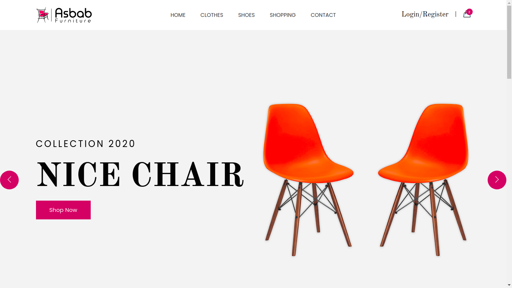
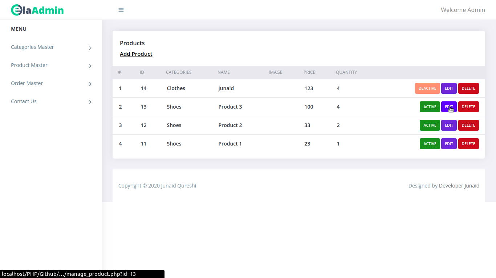

# Ecommerce Store Website

### *Ecommerce Store Website, with Admin Panel and User Registration System using PHP and mySQL.*

### Home

### Admin Panel

## Work in progress .....
## Features Added till now

- Admin Panel
- Frontend
- Categories
- Products
- Contact Us
- User Management
- Login Registration
- View Products
- Form Validation
- Accessibility Optimized

## Run Locally 

- Run this command `git clone https://github.com/developer-junaid/EcommerceApplication.git`
- You are now in the dev environment and you can play around 

## Tech Stack

- HTML5
- CSS3
- Javascript
- PHP
- Database "mySQL"
